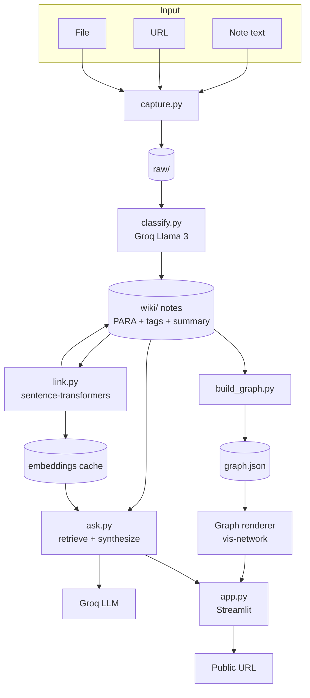
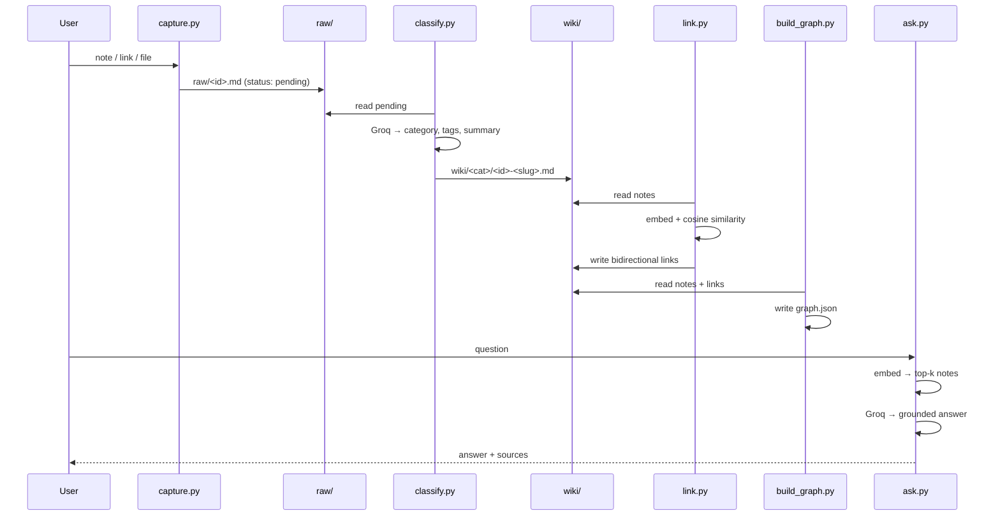
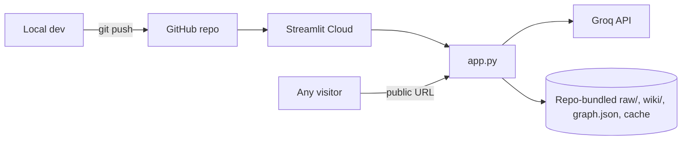

# SecondSelf Architecture Overview

A design document outlining a file-based personal knowledge pipeline using PARA, LLMs, embeddings, and a Streamlit UI.

# SecondSelf — Architecture

> How we will build the project described in `ProblemStatement.md`.

## 1. Overview

SecondSelf is a pipeline of small, single-purpose Python modules that share a **file-based data store** (`raw/`, `wiki/`, `graph.json`) and are surfaced through one Streamlit app.

**Design principles**

- **Files as the database.** Plain Markdown and JSON. Human-readable, git-friendly, and no DB to host.
- **Each stage is independent and re-runnable.** Every module reads the previous stage's output and writes its own; each is callable from the CLI and importable by the UI.
- **Idempotent.** Re-running a stage never duplicates or corrupts data.
- **Free tier only.** Groq (Llama 3) for LLM calls, local `sentence-transformers` for embeddings, Streamlit Cloud or HF Spaces for hosting.
- **Fail soft.** If the LLM or network is unavailable, the pipeline degrades gracefully instead of losing captures.

## 2. High-Level Architecture



## 3. Components

| Module | Responsibility | Reads | Writes |
|---|---|---|---|
| `capture.py` | Ingest note / link / file into `raw/` | user input | `raw/*` |
| `classify.py` | LLM: PARA category, tags, summary | `raw/*` | `wiki/*.md` |
| `link.py` | Embed notes, find related, insert links | `wiki/*.md` | `wiki/*.md`, `.cache/embeddings.*` |
| `build_graph.py` | Notes + links → nodes/edges | `wiki/*.md` | `graph.json` |
| `graph_view.py` | Render `graph.json` as interactive HTML | `graph.json` | HTML string |
| `ask.py` | RAG: retrieve top-k notes, synthesize answer | `wiki/*.md`, embeddings | answer + sources |
| `app.py` | Streamlit UI: capture, graph, ask | all of the above | — |
| `config.py` | Paths, thresholds, model names, env loading | `.env` / secrets | — |
| `utils.py` | Shared helpers: IDs, frontmatter I/O, slugs | — | — |

`graph_view.py`, `config.py`, and `utils.py` are small additions to the suggested repo structure to avoid duplication.

### 3.1 `capture.py` — Ingestion

**CLI**

```bash
python capture.py note "Idea: use spaced repetition for..."
python capture.py link https://example.com/article
python capture.py file ./papers/attention.pdf
python capture.py "some text"          # auto-detect type
```

**Type detection:** starts with `http(s)://` → link; path exists on disk → file; otherwise → note.

**Per-type handling**

| Type | What is stored |
|---|---|
| Note | Text as given |
| Link | URL, plus fetched page title and extracted main text (`requests` + `trafilatura` or `beautifulsoup4`); on fetch failure, store the URL only and flag it |
| File | Extracted text (`.txt`/`.md` direct, `.pdf` via `pypdf`), original file copied to `raw/attachments/` |

**Unique ID:** `YYYYMMDD-HHMMSS-<6 hex chars>` (timestamp prefix keeps files sortable; the suffix prevents same-second collisions). Example: `20260928-141502-a3f9c1`.

**Raw file format** (`raw/<id>.md`):

```markdown
---
id: 20260928-141502-a3f9c1
captured_at: 2026-09-28T14:15:02+05:30
type: link            # note | link | file
source: https://example.com/article
title: Example Article
status: pending       # pending | classified | failed
---

<raw content here>
```

Storing metadata as YAML frontmatter keeps a single self-describing file per capture.

### 3.2 `classify.py` — The Sorting Hat

**Input:** a raw file. **Output:** a wiki note.

**LLM call:** Groq API, Llama 3 model (e.g., `llama-3.1-8b-instant`; configurable), with JSON-mode output.

**Prompt contract**

```
System: You organize personal notes using the PARA method.
  Projects  = active efforts with a goal and deadline
  Areas     = ongoing responsibilities with no end date
  Resources = topics of interest / reference material
  Archives  = inactive or completed items
Return ONLY JSON: {"category": "...", "tags": ["..."], "summary": "..."}
  - category: exactly one of Projects | Areas | Resources | Archives
  - tags: 3-6 lowercase single words or hyphenated phrases
  - summary: one sentence, max 25 words

User: <title + content, truncated to N chars>
```

**Post-processing:** validate the JSON, coerce the category to the allowed set (fallback: `Resources`), normalize tags (lowercase, dedupe, max 6), trim the summary.

**Wiki note format** (`wiki/<category>/<id>-<slug>.md`, or flat `wiki/` with category in frontmatter; folder-per-category recommended for browsability):

```markdown
---
id: 20260928-141502-a3f9c1
title: Example Article
category: Resources
tags: [ai, retrieval, embeddings]
summary: One-line summary here.
source: https://example.com/article
captured_at: 2026-09-28T14:15:02+05:30
classified_at: 2026-09-28T14:20:11+05:30
raw: raw/20260928-141502-a3f9c1.md
links: []
---

<content>

## Related
<!-- managed by link.py -->
```

**Reliability:** retry with exponential backoff on 429/5xx, and throttle to respect Groq free-tier rate limits. On permanent failure, mark the raw file `status: failed` and continue the batch.

### 3.3 `link.py` — Auto-Linking

**Embedding model:** `sentence-transformers/all-MiniLM-L6-v2` (about 80 MB, fast on CPU, 384 dimensions).

**Text embedded per note:** `title + summary + tags + first ~1,000 chars of body`. Long documents are chunked; for note-to-note linking, use a mean of chunk vectors or the title/summary/lead embedding.

**Algorithm**

1. Load the embedding cache (`.cache/embeddings.npz` plus an `index.json` mapping id → row and content hash).
2. Embed only notes that are new or whose content hash changed.
3. For a new note, compute cosine similarity against all existing notes (normalized vectors → dot product).
4. Select candidates with `similarity ≥ THRESHOLD` (default **0.45**, tunable), capped at the top-K (default **5**) per note.
5. Write links **bidirectionally** into both notes' frontmatter (`links: [{id, score}]`) and into the `## Related` section as wiki-style links: `[[<id>-<slug>]]`.
6. Persist the cache.

**Why a threshold plus a top-K cap:** the threshold prevents junk links; the cap prevents hub nodes from turning the graph into a hairball.

**Tuning:** MiniLM similarities for genuinely related short notes typically fall in the 0.35–0.6 range. Expose `--threshold` on the CLI and print the score distribution so the value can be tuned against real data.

### 3.4 `build_graph.py` — Graph Data Model

Reads every wiki note and emits:

```json
{
  "meta": { "generated_at": "...", "node_count": 18, "edge_count": 27 },
  "nodes": [
    {
      "id": "20260928-141502-a3f9c1",
      "label": "Example Article",
      "category": "Resources",
      "tags": ["ai", "retrieval"],
      "summary": "One-line summary.",
      "content": "First ~600 chars for hover popup",
      "source": "https://example.com/article",
      "degree": 3
    }
  ],
  "edges": [
    { "from": "id-a", "to": "id-b", "weight": 0.61 }
  ]
}
```

**Rules**

- One node per note; one edge per unordered pair (dedupe A→B and B→A).
- Drop edges whose endpoints are missing (dangling links).
- Compute `degree` per node, used for node size.
- Deterministic output (sorted) so diffs stay clean.

### 3.5 `graph_view.py` — Interactive Graph

Generates a self-contained HTML string using **vis-network** (loaded from CDN), embedded in Streamlit via `streamlit.components.v1.html(...)`.

| Requirement | Implementation |
|---|---|
| Force-directed layout | vis-network physics (`forceAtlas2Based` or `barnesHut`) |
| Nodes "alive" | CSS-like pulse via animated node `size`/`shadow` on a timer, or a subtle continuous physics jitter |
| Color by PARA category | Projects / Areas / Resources / Archives → 4 distinct colors, with a legend |
| Node size | Scaled by `degree` |
| Edge thickness | Scaled by similarity `weight` |
| Hover popup | vis-network `title` as an HTML element showing title, category, tags, summary, and content excerpt |
| Drag + zoom | Built-in (`interaction: { dragNodes, zoomView, hover: true }`) |
| Click | Selects a node and (optionally) sends the id back to Streamlit to show the full note |

Sanitize/escape all note text before injecting into HTML to prevent XSS from captured web content.

### 3.6 `ask.py` — Retrieval-Augmented Q&A

```python
def ask(question: str, k: int = 5) -> dict:
    """Returns {"answer": str, "sources": [{"id","title","score"}]}"""
```

**Flow**

1. Embed the question with the same model as `link.py`.
2. Cosine-similarity search over the cached note embeddings; take the top-k above a minimum relevance floor.
3. **Optional graph expansion:** also pull 1-hop linked neighbors of the top hit(s) for extra context.
4. Build a context block: for each retrieved note, `[id | title] + summary + body (truncated to a token budget)`.
5. Call the Groq LLM with a grounded prompt.
6. Return the answer plus source notes (rendered in the UI as citations, and highlighted in the graph).

**Grounding prompt**

```
Answer the question using ONLY the notes below. Cite notes by [id].
If the notes do not contain the answer, say you don't have that in the
user's notes. Do not use outside knowledge.

Notes:
<context>

Question: <question>
```

**Guardrails:** if retrieval returns nothing above the floor, skip the LLM call and answer "I couldn't find anything relevant in your notes." Cap the context at a fixed token budget.

### 3.7 `app.py` — Streamlit UI

**Layout**

| Area | Content |
|---|---|
| Sidebar | Capture form (note / link / file upload), "Process new captures" button (classify + link + rebuild graph), stats (note count, edge count, categories) |
| Tab 1 — Brain | Interactive graph, category legend and filters |
| Tab 2 — Ask | Question box, answer, and cited source notes; cited nodes highlighted on the graph |
| Tab 3 — Notes (optional) | Browse notes by PARA category |

**Behavior**

- `@st.cache_resource` for the embedding model (load once per process).
- `@st.cache_data` for `graph.json`, invalidated when the file's mtime changes.
- Secrets read via `st.secrets["GROQ_API_KEY"]` (deployed) or `.env` (local).
- The capture button runs the full pipeline: capture → classify → link → build graph, with progress indicators.

## 4. Data Flow (End to End)



## 5. Data Storage Layout

```
secondself/
├── raw/
│   ├── 20260928-141502-a3f9c1.md
│   └── attachments/               # original uploaded files
├── wiki/
│   ├── Projects/
│   ├── Areas/
│   ├── Resources/
│   └── Archives/
├── .cache/
│   ├── embeddings.npz             # note vectors
│   └── index.json                 # id → row, content hash
├── graph.json
├── capture.py  classify.py  link.py  build_graph.py
├── graph_view.py  ask.py  app.py
├── config.py  utils.py
├── requirements.txt
├── .env.example
├── .gitignore
└── README.md
```

**Configuration (`config.py`)**

| Setting | Default | Notes |
|---|---|---|
| `GROQ_API_KEY` | — | env var or Streamlit secret; never committed |
| `LLM_MODEL` | `llama-3.1-8b-instant` | configurable |
| `EMBED_MODEL` | `all-MiniLM-L6-v2` | |
| `LINK_THRESHOLD` | `0.45` | tune on real notes |
| `LINK_TOP_K` | `5` | max links per note |
| `ASK_TOP_K` | `5` | notes retrieved per question |
| `ASK_MIN_SCORE` | `0.25` | relevance floor |
| `MAX_CONTENT_CHARS` | `6000` | truncation for LLM prompts |

## 6. Technology Stack

| Concern | Choice | Reason |
|---|---|---|
| Language | Python 3.10+ | One language for the whole pipeline |
| LLM | Groq API, Llama 3 | Free tier, very fast |
| Embeddings | `sentence-transformers` (MiniLM) | Local, free, no API limits |
| Vector search | NumPy cosine similarity | A personal wiki is small (hundreds of notes); no vector DB needed |
| Web extraction | `requests` + `trafilatura` / `beautifulsoup4` | Clean article text from URLs |
| PDF extraction | `pypdf` | Lightweight |
| Frontmatter | `python-frontmatter` / `PyYAML` | Reliable metadata I/O |
| Graph render | vis-network (JS via CDN) | Force-directed, hover, drag, zoom out of the box |
| UI | Streamlit | Single-file app with free hosting |
| Hosting | Streamlit Community Cloud (primary), HF Spaces (fallback) | Free public URL |

**`requirements.txt` (starting point):** `streamlit`, `groq`, `sentence-transformers`, `numpy`, `python-frontmatter`, `pyyaml`, `requests`, `trafilatura`, `beautifulsoup4`, `pypdf`, `python-dotenv`.

## 7. Deployment Architecture



**Key deployment constraints and decisions**

1. **Ephemeral filesystem.** Streamlit Cloud resets local writes on restart or redeploy. Therefore:
   - The **committed** `wiki/`, `graph.json`, and embedding cache are the persistent knowledge base the deployed app reads.
   - Captures made *in the deployed app* are session-level unless persisted elsewhere. Options, in order of simplicity:
     a. Treat the deployed app as a read/ask/explore demo plus in-session capture (recommended baseline).
     b. Persist via GitHub API commits, or a Hugging Face Dataset repo, if durable public capture is required.
2. **Pre-compute embeddings** and commit the cache, so cold starts don't re-embed everything.
3. **Model download on cold start:** MiniLM (~80 MB) downloads on first run; cache it with `@st.cache_resource`. Pin `torch` CPU-only if the build is too heavy for the free tier.
4. **Secrets:** `GROQ_API_KEY` goes in Streamlit Cloud's Secrets manager. `.env` is in `.gitignore`.
5. **Public exposure:** anyone with the URL can use the deployed app, which spends the owner's Groq quota. Add basic rate limiting (per-session request cap) and keep private notes out of the public repo. The demo wiki should contain only content the author is comfortable publishing.
6. **Dependencies:** pin versions in `requirements.txt` for reproducible builds.

## 8. Cross-Cutting Concerns

**Error handling**

- Every external call (Groq, HTTP fetch, file I/O) is wrapped with clear, non-fatal errors in batch mode.
- Status fields (`pending` / `classified` / `failed`) make the pipeline resumable.

**Idempotency**

- Classification skips raw files already marked `classified`.
- Linking uses content hashes so unchanged notes aren't re-embedded, and writing links replaces the managed `## Related` block instead of appending.

**Security**

- Escape note content in HTML (graph popups, Streamlit markdown).
- Sanitize uploaded filenames; restrict accepted file types and size.
- Only fetch `http`/`https` URLs, with timeouts, and block private/internal IP ranges (SSRF).
- Treat captured web content as untrusted input to the LLM (prompt-injection risk): the system prompt should instruct the model to treat note text as data, and answers are grounded and cited.

**Observability**

- Simple `logging` to console with per-stage counts (captured, classified, linked, failed).
- Print the similarity score distribution during linking, to help tune the threshold.

**Testing strategy**

| Level | What |
|---|---|
| Unit | ID generation, type detection, frontmatter round-trip, JSON parsing/validation of LLM output, threshold/top-K linking logic, graph dedupe |
| Integration | raw → wiki → links → graph on a small fixture set, with the LLM mocked |
| Manual (real data) | 15+ real notes end to end; hand-check that links make sense; ask ~10 real questions and verify grounding |
| Deployed smoke test | Graph loads, hover/drag/zoom work, `ask()` returns cited answers on the public URL |

## 9. Scalability and Limits

- **Sweet spot:** hundreds to low thousands of notes. NumPy brute-force cosine similarity and in-memory graphs are trivially fast at this scale.
- **If it grows:** swap the NumPy search for FAISS or Chroma behind the same `ask.py` retrieval interface; paginate or cluster the graph past ~500 nodes (vis-network gets sluggish).
- **LLM limits:** Groq free tier is rate limited, so batch classification is throttled with backoff; long notes are truncated (or map-reduce summarized) before the prompt.

## 10. Mapping to Acceptance Criteria

| Acceptance criterion | Satisfied by |
|---|---|
| `raw/` + `wiki/` exist | Repo scaffold (§5) |
| One command captures note, link, file | `capture.py` type detection (§3.1) |
| Timestamp + unique ID | ID scheme and frontmatter (§3.1) |
| Category + tags + summary automatically | `classify.py` (§3.2) |
| PARA categorization | Prompt contract and category validation (§3.2) |
| Embeddings per note | `link.py` cache (§3.3) |
| Auto-linking without manual tags | Threshold + top-K bidirectional links (§3.3) |
| Graph JSON export | `build_graph.py` (§3.4) |
| Force-directed graph, hover, drag, zoom | `graph_view.py` (§3.5) |
| `ask()` synthesized from own notes | `ask.py` RAG (§3.6) |
| Graph + search in one Streamlit app | `app.py` (§3.7) |
| Public URL, end-to-end works | Deployment architecture (§7) |

## 11. Open Decisions to Confirm Before Implementation

1. **Persistence in the deployed app:** demo-only (committed data) vs. durable public capture (GitHub / HF Dataset).
2. **Wiki layout:** folder-per-PARA-category (recommended) vs. flat folder with category in frontmatter.
3. **Groq model:** `llama-3.1-8b-instant` (faster, higher rate limits) vs. `llama-3.3-70b-versatile` (better classification quality, tighter limits).
4. **Link threshold:** start at 0.45 and adjust after inspecting real score distributions.

## Related

<!-- secondself:related:start -->
- [[projects/implementation-plan|Implementation Plan]]
- [[projects/secondself-your-personal-ai-second-brain|SecondSelf — Your Personal AI Second Brain]]
- [[projects/secondself-project-plan|SecondSelf Project Plan]]
<!-- secondself:related:end -->